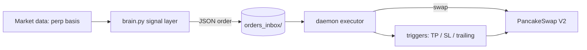

# Alpha Radar

Predictive AI trading agent for BNB Hack: AI Trading Agent Edition (Track 1, Autonomous Trading Agents). Reads cross-market signals, decides, and executes its own swaps on BNB Chain within rules you set.

[](https://bscscan.com)
[](https://pancakeswap.finance)
[](https://bscscan.com/token/0x55d398326f99059ff775485246999027b3197955)

## What it does

Alpha Radar separates the brain (signal generation) from the hands (on-chain execution). The brain studies derivatives positioning across the market, finds names that are stretched, and hands the executor a plain order. The executor signs and lands the swap on BSC, then manages the position to a target or stop.

It trades live during the competition week and is scored purely on realized PnL, with a drawdown gate as a risk limit.

## Strategy

The signal layer (`src/brain.py`) works on perpetual basis:

- Pulls Binance perpetual basis data per token from the market data warehouse.
- Computes a rolling 168-hour z-score of the basis (`basis_z`).
- Selects a rolling TOP-5 by strength, without look-ahead.
- Emits a LONG order when `basis_z` crosses above +3.5 sigma on a TOP-5 token.

Backtest of the signal: cycle 76/79, p = 0/200, Z = +4.35, about +245 bp per trade net taking both sides on Binance perps. Restricted to LONG-only on PancakeSwap spot (the live setup here) it is about +113 bp per trade net (cycle 90). A minimum-trade qualifier keeps the agent active enough to satisfy the competition rule of at least one trade per day.

This is spot, long-only, self-custody. No leverage, no shorting.

## Architecture



- `src/brain.py` writes JSON orders into `orders_inbox/`. Runs on a 5 minute schedule.
- `src/daemon.py` picks orders up atomically, executes, and persists state so it survives restarts.
- `src/executor.py` routes the swap. Default path is direct PancakeSwap V2; an optional aggregator and an optional Trust Wallet Agent Kit path exist but are off by default.
- `src/triggers.py` is a single engine for limit entries plus take-profit, stop-loss, and trailing exits.
- Base currency is USDT. BNB is held only for gas.

## Execution

Direct on PancakeSwap V2 via web3. Every swap waits for a receipt with status 1 and derives the fill from the balance delta. RPC rotation and per-wallet nonce management are built in. Multi-hop routes go through WBNB.

## Eligible tokens

Trades are restricted to the competition's fixed BEP-20 allowlist (see `allowed_tokens` in `config.example.yaml`). Trades outside the list do not count.

## Competition

- Track 1 registration is on-chain. Competition contract: `0x212c61b9b72c95d95bf29cf032f5e5635629aed5` (BSC).
- Register the agent wallet before the trading window opens.
- Scoring: total return with a max drawdown gate, a minimum trade count, and simulated transaction costs.

## Configuration

Copy `config.example.yaml` to `config.yaml` and fill it in. Secrets never live in the repo:

- Wallet keys come from environment (`private_key: "env:BODY1_PK"`) or an encrypted keystore (`private_key: "keystore:keystores/body1.json"` with `TWAK_KEYSTORE_PASSWORD` set).
- `config.yaml`, `keystores/`, state, logs, and inbox folders are git-ignored.

## Run

```bash
python -m venv .venv && . .venv/bin/activate
pip install -r requirements.txt
cp config.example.yaml config.yaml   # fill wallet + RPC

# executor
python -m src.daemon --config config.yaml --inbox orders_inbox --results results

# signal layer (cron, every 5 min)
python src/brain.py --config config.yaml --inbox orders_inbox
```

## Risk

This agent moves real funds on-chain and can lose money. Spot, low-liquidity tokens can have severe slippage. Run it only with capital you can lose, inside the guardrails in your config (allowlist, drawdown cap, per-trade and daily limits, slippage protection). No warranty.
